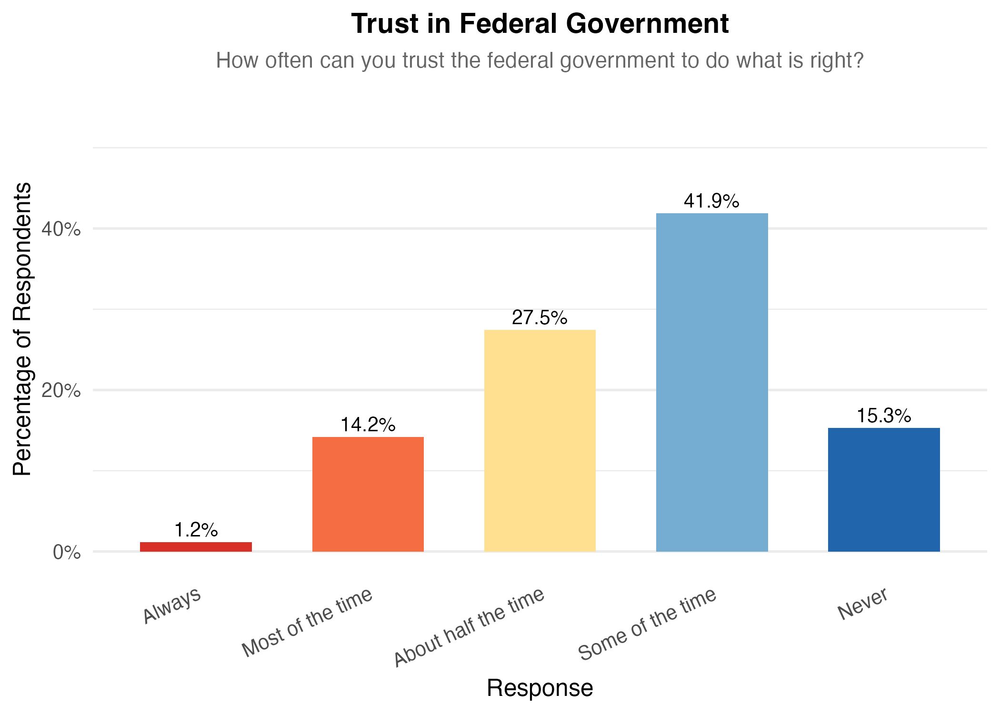
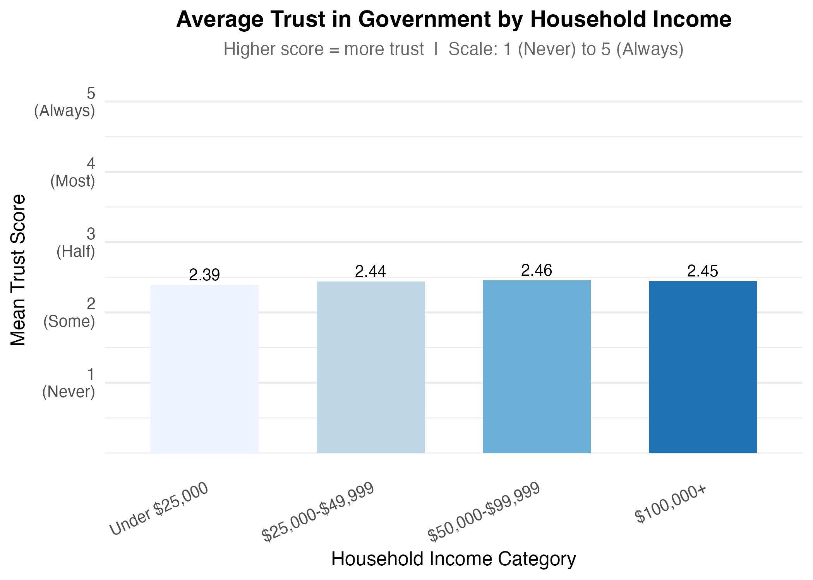
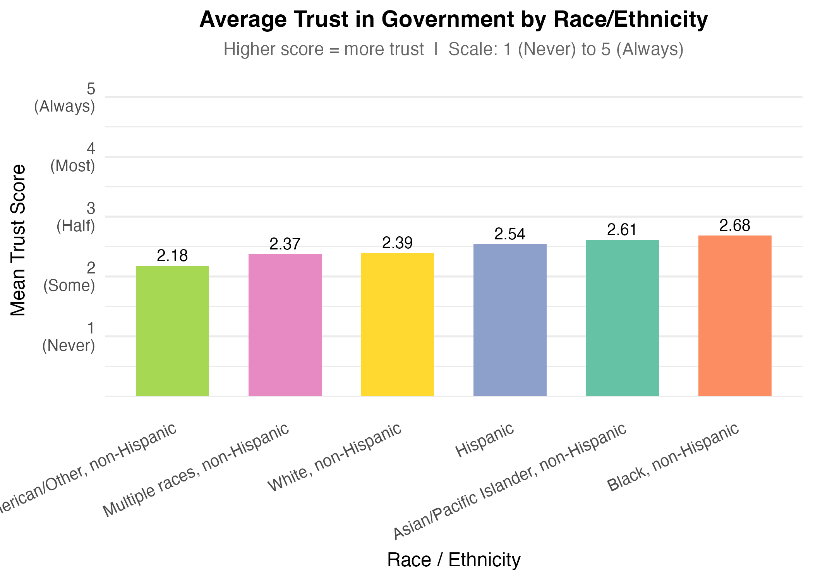
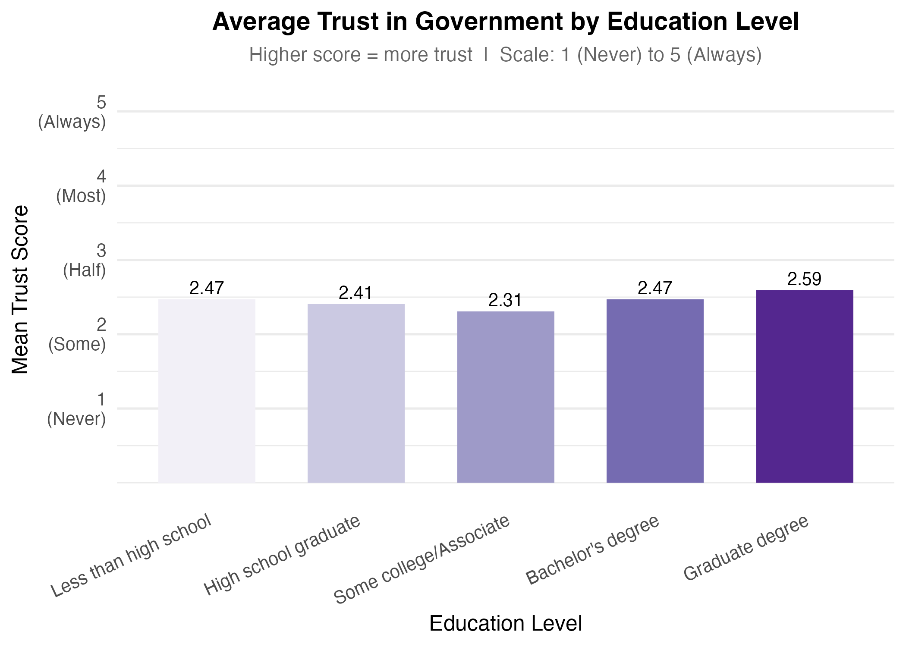
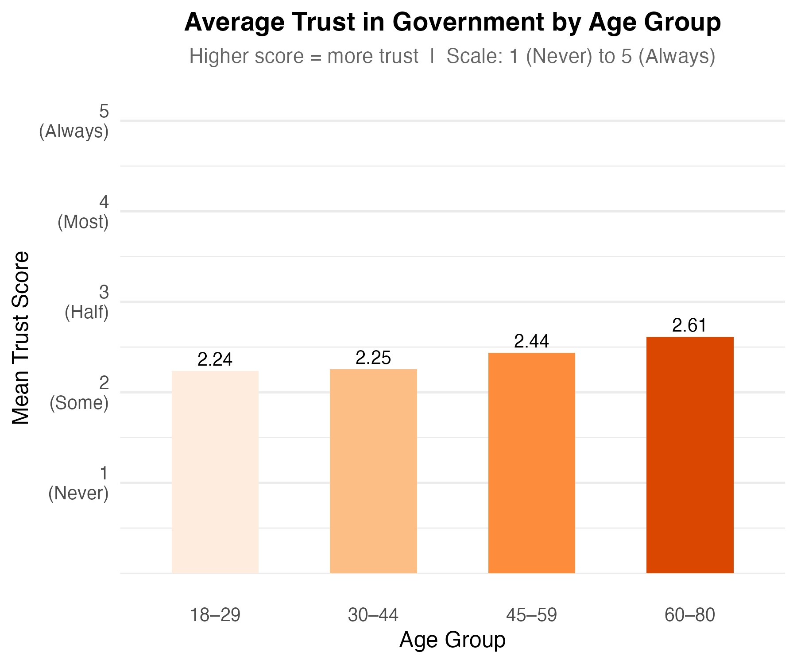
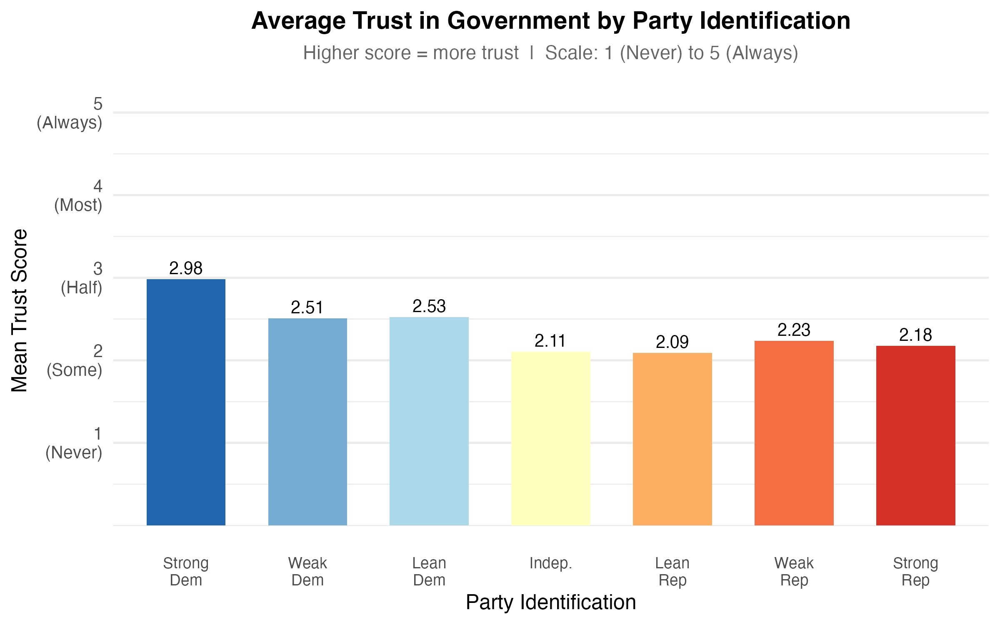
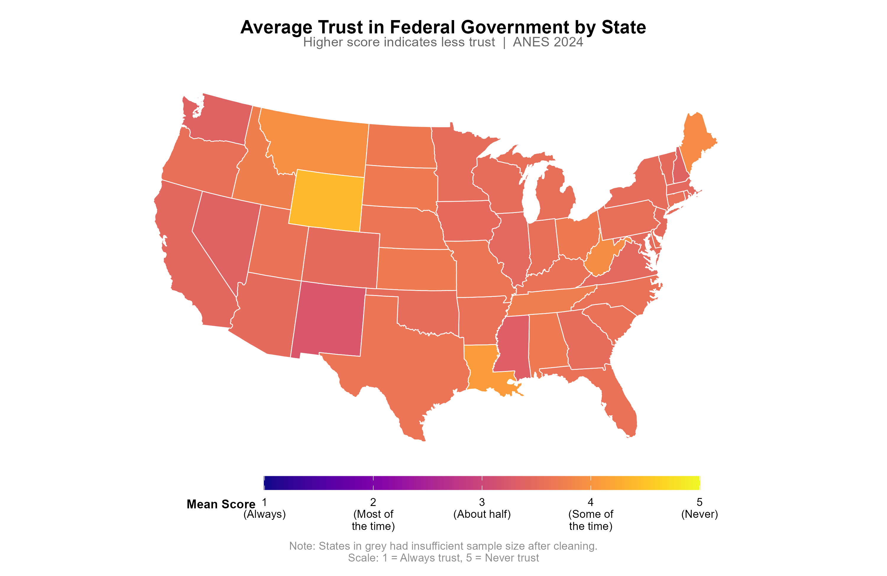

# MEMORANDUM

To: United States Government Officials

From: Allie Sensinger, Allan Canfield, Bailey Whitaker, Lori Sheets, and Spencer Tuft

Date: March 24, 2026

Subject: Descriptive Patterns in Trust in the Federal Government

This memorandum summarizes descriptive patterns in trust in the federal government using the 2024 American National Election Studies (ANES) survey. The analysis focuses on differences by household income, race and ethnicity, and educational attainment, while also reporting descriptive patterns by age, party identification, and state. This memo does not estimate regression models and does not make causal claims. Instead, it reports and interprets descriptive statistics so that these patterns are clear before any future multivariate analysis is conducted.

Trust in the federal government is measured on a five-point scale where `1 = Always`, `2 = Most of the time`, `3 = About half the time`, `4 = Some of the time`, and `5 = Never`. Higher values therefore indicate lower trust. Across 5,498 valid responses, the overall mean trust score is `3.56`, which suggests that respondents cluster between "About half the time" and "Some of the time." The response distribution reinforces that pattern: 41.9% answered "Some of the time," 27.5% answered "About half the time," 15.3% answered "Never," 14.2% answered "Most of the time," and 1.2% answered "Always."

## HOUSEHOLD INCOME

Descriptively, trust in government varies only modestly across income groups.

| Household income category | N | Mean trust score |
|---|---:|---:|
| $50,000-$99,999 | 1,390 | 3.54 |
| $100,000+ | 1,951 | 3.55 |
| $25,000-$49,999 | 760 | 3.56 |
| Under $25,000 | 852 | 3.61 |

The income differences are small. The full range runs from `3.54` to `3.61`, a spread of only `0.07` points on a five-point scale. Respondents in the lowest-income category report slightly less trust on average than respondents in the higher-income categories, but the pattern is weak. Based on these descriptive statistics alone, income does not appear to be associated with large differences in trust in the federal government.

## RACE AND ETHNICITY

Descriptive differences by race and ethnicity are larger than the differences by income.

| Race / ethnicity | N | Mean trust score |
|---|---:|---:|
| Black, non-Hispanic | 506 | 3.32 |
| Asian/Pacific Islander, non-Hispanic | 196 | 3.39 |
| Hispanic | 581 | 3.46 |
| White, non-Hispanic | 3,932 | 3.61 |
| Multiple races, non-Hispanic | 187 | 3.63 |
| Native American/Other, non-Hispanic | 33 | 3.82 |

These descriptive statistics suggest that Black non-Hispanic respondents report the highest average trust, followed by Asian/Pacific Islander and Hispanic respondents. White non-Hispanic, multiracial, and Native American/Other respondents report lower average trust. The spread from `3.32` to `3.82` is `0.50` points, which is substantially larger than the spread across income categories. At the same time, the smallest groups, especially Native American/Other non-Hispanic respondents (`n = 33`), should be interpreted cautiously because small samples can make group averages less stable.

## EDUCATIONAL ATTAINMENT

Educational attainment also shows visible descriptive differences.

| Education category | N | Mean trust score |
|---|---:|---:|
| Graduate degree | 1,045 | 3.41 |
| Bachelor's degree | 1,326 | 3.53 |
| Less than high school | 267 | 3.53 |
| High school graduate | 904 | 3.59 |
| Some college/Associate | 1,638 | 3.69 |

The lowest average distrust appears among respondents with graduate degrees (`3.41`), while the highest appears among those with some college or an associate degree (`3.69`). The spread across education categories is `0.28` points, which is larger than the income gap but smaller than the racial and ethnic gap. This pattern does not follow a simple linear story in which trust steadily rises or falls with each step in education. Instead, the descriptive statistics indicate that respondents with some college or an associate degree are the least trusting on average, while those with graduate degrees are the most trusting.

## ADDITIONAL DESCRIPTIVE PATTERNS

Two additional descriptive patterns are worth noting because they help place the income, race, and education results in context. First, trust varies more clearly by age than by income. The average trust score is `3.76` among respondents ages 18 to 29 (`n = 549`) and `3.75` among those ages 30 to 44 (`n = 1,314`), compared with `3.56` among those ages 45 to 59 (`n = 1,198`) and `3.39` among those ages 60 to 80 (`n = 2,161`). This suggests that younger respondents are less trusting of the federal government on average, while older respondents are more trusting.

Second, party identification shows one of the clearest descriptive differences in the dataset. Strong Democrats have the lowest mean distrust score at `3.02` (`n = 1,310`), indicating the highest trust among party groups. At the other end, Independents (`3.89`, `n = 377`) and Independent-Republicans (`3.91`, `n = 716`) are the least trusting on average, while Strong Republicans also report relatively low trust (`3.82`, `n = 1,162`). These party differences are much larger than the income differences and are also larger than the education differences, which suggests that political orientation is likely to matter when interpreting trust in government.

## AVERAGE TRUST BY STATE

Average trust in the federal government also varies across states, and this state-level context may be useful in a future regression as a control variable. Across 51 state-level units with data, the mean state trust score ranges from `2.63` to `4.40`, with a national individual-level average of `3.56` and a standard deviation across state means of about `0.25`. States such as the District of Columbia (`2.63`), New Mexico (`3.22`), and Mississippi (`3.33`) appear more trusting on average, while Wyoming (`4.40`), Alaska (`4.25`), and Louisiana (`4.09`) appear less trusting on average.

The additional state summaries point in the same direction. The share of respondents classified as low trust is especially high in Wyoming, Alaska, Montana, and South Dakota, each of which has either extremely high or complete low-trust shares in the cleaned sample. Likewise, the deviation-from-average summary shows that Wyoming sits `0.84` points above the national mean trust score and Alaska sits `0.69` points above it, indicating meaningfully lower trust than the national average. On the more trusting side, the District of Columbia is nearly one full point below the most distrustful states and sits well below the national average.

This state-level variation matters because individuals are embedded in broader political and social environments. A future regression could use a respondent's state average trust score as a control variable to account for background differences in state-level political culture or institutional context. That would help separate individual-level demographic patterns from the broader trust climate of the state. However, these descriptive statistics should be interpreted cautiously for states with small numbers of respondents. The median state sample is `85`, but 14 states have fewer than 30 respondents and 10 states have fewer than 20 respondents, so some state averages are likely less stable than others.

